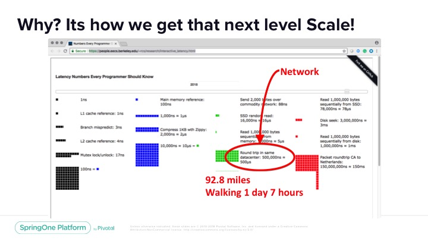
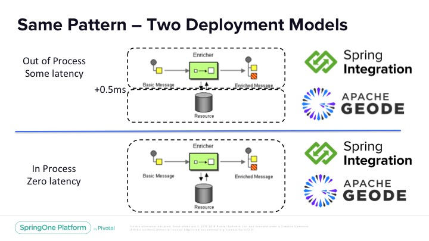
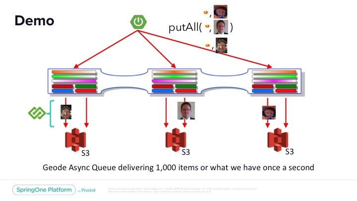

# Using Spring Integration with Apache Geode

In this example I show how we can use the power of Spring Integration to extend Apache Geode.   Specifically I am talking about how expand the capabilities of the Geode servers to achieve unparalleled performance with your spring integration pipelines.

How are specifically achieving this is through a feature in Apache Geode in where it knows where data lives.   So we can route data to the correct server for enrichment.   This allows the servers to not reach across the network for data enrichment or common claim check patterns.

**Cost of network**


**Same pattern - Two deployment models**


# What is included in this project

This project attempts to show how we can deploy spring integration to apache geode.   The pipeline then publishes all of the changes in data to S3.

**How the demo is configured**

```
create async-event-queue 
    --id=s3-queue 
    --listener=com.github.sigeode.AsyncS3Sink
    --listener-param=sigeode.awsregion#us-east-1 
    --batch-time-interval=1000 
    --batch-size=1000
    --parallel=true 
    --dispatcher-threads=2
    --persistent=true 
    --order-policy=KEY
    --enable-batch-conflation=true
```



